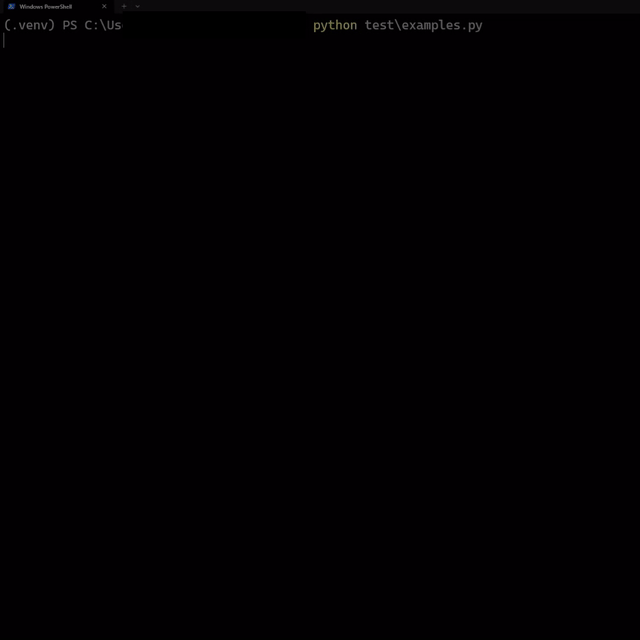

# ⚡ flashbar

Lightweight, pretty progress bars for Python CLI apps.

Zero dependencies. Python 3.8+. Just install and go.

<p align="center">
  
</p>

## Install

```bash
pip install flashbar
```

## Quick start

```python
from flashbar import track
import time

for item in track(range(100), label="Downloading"):
    time.sleep(0.02)
```

That's it. One import, one line.

## Progress bar

```python
from flashbar import Bar

bar = Bar(100, label="Processing", theme="green")
for i in range(100):
    bar.update()

# or jump to a specific value
bar = Bar(100)
bar.set(50)  # jump to 50%
bar.set(100) # done
```

### With context manager

Automatically completes the bar on exit, even on exceptions:

```python
with Bar(100, theme="retro", label="Building") as bar:
    for i in range(100):
        do_work()
        bar.update()
```

### ETA and speed

```python
# ETA is on by default
bar = Bar(1000, label="Training", show_eta=True)

# show items/sec too
bar = Bar(1000, label="Training", show_speed=True)
```

## Spinner

For tasks where you don't know the total:

```python
from flashbar import Spinner

with Spinner("Loading data...", style="dots"):
    load_big_file()

# manual control
sp = Spinner("Thinking...", style="circle", color="magenta")
sp.start()
result = heavy_computation()
sp.stop("Done!")
```

## Themes

See the demo GIF above to see each theme in action with real colors.

```python
from flashbar import Bar

for name in ["default", "green", "red", "retro", "minimal", "slim", "dots", "arrow"]:
    bar = Bar(30, theme=name, label=f"{name:8s}")
    for _ in range(30):
        bar.update()
```

| Theme     | Look                       |
|-----------|----------------------------|
| `default` | `█████░░░░░` 🔵 blue       |
| `green`   | `█████░░░░░` 🟢 green      |
| `red`     | `█████░░░░░` 🔴 red        |
| `retro`   | `#####.....` 🟡 yellow     |
| `minimal` | `─────     ` ⚪ white      |
| `slim`    | `━━━━━╺╺╺╺╺` 🔵 cyan      |
| `dots`    | `●●●●●○○○○○` 🟣 magenta   |
| `arrow`   | `▸▸▸▸▸▹▹▹▹▹` 🔵 blue      |

## Spinner styles

| Style    | Frames            |
|----------|-------------------|
| `dots`   | ⠋ ⠙ ⠹ ⠸ ⠼ ⠴ ⠦ ⠧ |
| `line`   | - \ \| /          |
| `circle` | ◐ ◓ ◑ ◒          |
| `bounce` | ⠁ ⠂ ⠄ ⠂          |
| `arrows` | ← ↑ → ↓          |
| `grow`   | ▏ ▎ ▍ ▌ ▋ ▊ ▉ █  |
| `moon`   | 🌑🌒🌓🌔🌕🌖🌗🌘   |

## Custom colors

```python
# named
Bar(100, color="cyan", label="Cyan bar")

# any hex color
Bar(100, color="#FF5733", label="Orange bar")
Bar(100, color="#00FF99", label="Mint bar")
```

## Custom characters

```python
Bar(100, fill="▓", empty="▒")
Bar(100, fill="=", empty="-")
Bar(100, fill="●", empty="○", color="#FF69B4")
```

## Generators and iterators

`track()` works with anything that has `len()`. For generators, pass `total=`:

```python
def my_generator():
    for i in range(1000):
        yield i

for item in track(my_generator(), total=1000, label="Generating"):
    process(item)
```

## API reference

### `Bar(total, **options)`

| Param        | Type   | Default     | Description                         |
|--------------|--------|-------------|-------------------------------------|
| `total`      | int    | required    | Number of steps                     |
| `width`      | int    | `40`        | Bar width in characters             |
| `theme`      | str    | `"default"` | Theme name                          |
| `label`      | str    | `""`        | Text before the bar                 |
| `color`      | str    | `None`      | Override color (name or hex)        |
| `fill`       | str    | `None`      | Override fill character             |
| `empty`      | str    | `None`      | Override empty character            |
| `show_eta`   | bool   | `True`      | Show estimated time remaining       |
| `show_speed` | bool   | `False`     | Show items/sec                      |

Methods: `.update(step=1)`, `.set(value)`, context manager.

### `track(iterable, **options)`

Same options as `Bar`, plus `total=` for iterables without `len()`.

### `Spinner(label, **options)`

| Param   | Type  | Default  | Description              |
|---------|-------|----------|--------------------------|
| `label` | str   | `""`     | Text next to spinner     |
| `style` | str   | `"dots"` | Spinner animation style  |
| `color` | str   | `"cyan"` | Color (name or hex)      |
| `speed` | float | `0.08`   | Seconds between frames   |

Methods: `.start()`, `.stop(final_text=None)`, context manager.

## License

MIT
